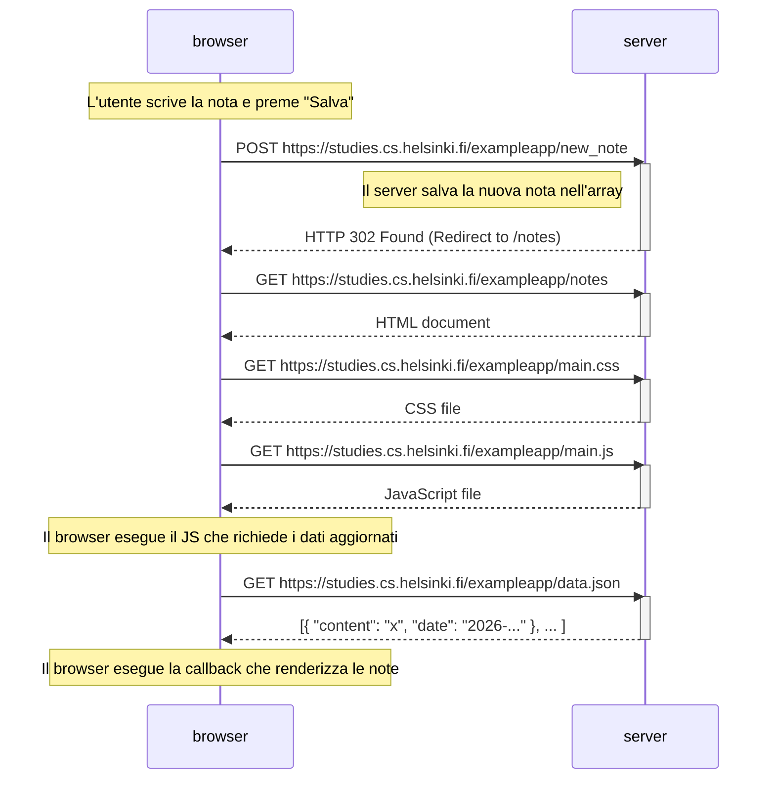

```mermaid
sequenceDiagram
    participant browser
    participant server

    Note over browser: L'utente scrive la nota e preme "Salva"

    browser->>server: POST https://studies.cs.helsinki.fi/exampleapp/new_note
    activate server
    Note left of server: Il server salva la nuova nota nell'array
    server-->>browser: HTTP 302 Found (Redirect to /notes)
    deactivate server

    browser->>server: GET https://studies.cs.helsinki.fi/exampleapp/notes
    activate server
    server-->>browser: HTML document
    deactivate server

    browser->>server: GET https://studies.cs.helsinki.fi/exampleapp/main.css
    activate server
    server-->>browser: CSS file
    deactivate server

    browser->>server: GET https://studies.cs.helsinki.fi/exampleapp/main.js
    activate server
    server-->>browser: JavaScript file
    deactivate server

    Note over browser: Il browser esegue il JS che richiede i dati aggiornati

    browser->>server: GET https://studies.cs.helsinki.fi/exampleapp/data.json
    activate server
    server-->>browser: [{ "content": "x", "date": "2026-..." }, ... ]
    deactivate server

    Note over browser: Il browser esegue la callback che renderizza le note
```